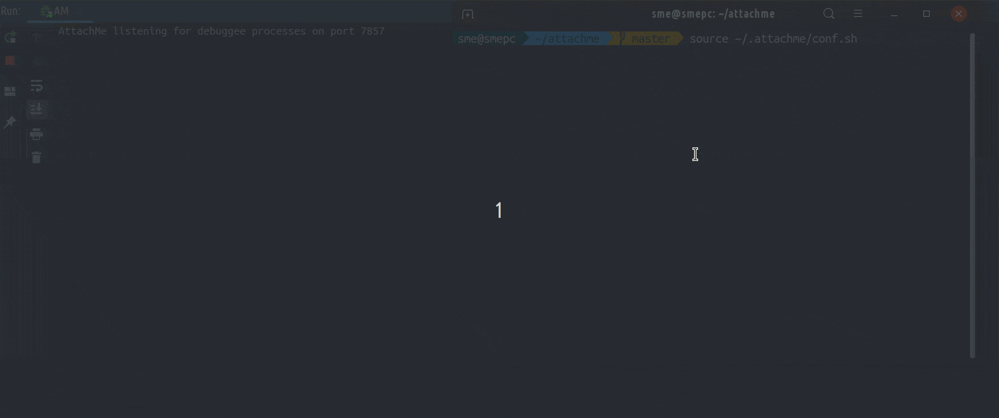

## AttachMe - IntelliJ debugger plugin

- AttachMe will attach the IntelliJ debugger automatically even if you start your app from terminal (or any other way).
You don't need to trigger `Attach to process` action manually.
- If you have a complex process hierarchy with many parent/child processes,
AttachMe can auto-attach to all the newly forked child JVM processes.
The behaviour will be similar to `set follow-fork-mode child` in the GDB debugger.





### Usage

1. Download and install the plugin from the plugin marketplace. [https://plugins.jetbrains.com/plugin/13263-attachme/](https://plugins.jetbrains.com/plugin/13263-attachme/)

2. Start the AttachMe listener by going to `Run > Edit Configurations > Add New`. Then search for `Attachme`, select it, and run.

3. On the first run, the plugin will install a JVM agent jar and a bash configuration script in the $HOME/.attachme/ directory. To auto-attach the debugger, configure AttachMe like this:

```
source ~/.attachme/conf.sh

java com.example.MyApp # anything that runs on the JVM
```

Now you should see a new debugger window attached to the process and any of its child processes.

  
If you want to have custom JDWP or AttachMe port configuration, you can run it like this:

```
JDWP_ARGS="transport=dt_socket..." AM_PORT=9009 source ~/.attachme/conf.sh

java com.example.MyApp
```

  

### Known Issues

  

You may have a problem with the bind address, which will manifest itself with this error: 
```
JDWP exit error AGENT_ERROR_TRANSPORT_INIT(197): No transports initialized [debugInit.c:750]
``` 

To fix it, try to configure AttachMe with port address 127.0.0.1, like this:
```
JDWP_ARGS="transport=dt_socket,server=y,suspend=y,address=127.0.0.1:0" source ~/.attachme/conf.sh
```

AttachMe is not compatible with the JMX agent. If you are having problems running it with the auto generated SpringBoot run configuration, most likely disabling JMX will fix the problem.
